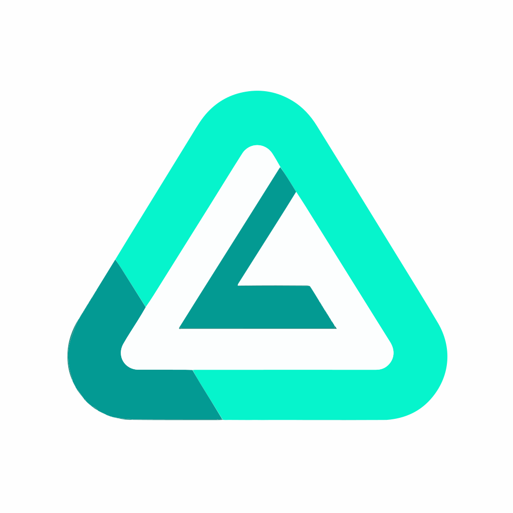

[![NPM Version][npm-image]][npm-url]
[![Downloads Stats][npm-downloads]][npm-url]
[![Contributors][contributors-shield]][contributors-url]
[![Forks][forks-shield]][forks-url]
[![Stargazers][stars-shield]][stars-url]
[![Issues][issues-shield]][issues-url]
[![MIT License][license-shield]][license-url]
[![LinkedIn][linkedin-shield]][linkedin-url]

<!-- PROJECT LOGO -->
<br />
<div align="center">
  <a href="https://github.com/Slauva/arops">
    
  </a>

  <h3 align="center">Arops</h3>

  <p align="center">
    A simple and lightweight library of utilities for working with arrays
    <br />
    <a href="https://github.com/Slauva/arops"><strong>Explore the docs »</strong></a>
    <br />
    <br />
    <a href="https://github.com/Slauva/arops/issues">Report Bug</a>
    ·
    <a href="https://github.com/Slauva/arops/issues">Request Feature</a>
  </p>
</div>

<!-- INSTALLATION -->

## Installation

npm

```bash
npm i @slauva/arops
```

yarn

```bash
yarn add @slauva/arops
```

<!-- Documentations -->

## API References

### Math operations

#### Logic operations

- [:gear: less](docs/logic.md#gear-less)
- [:gear: greater](docs/logic.md#gear-greater)
- [:gear: equal](docs/logic.md#gear-equal)
- [:gear: all](docs/logic.md#gear-all)
- [:gear: some](docs/logic.md#gear-some)
- [:gear: condition](docs/logic.md#gear-condition)

#### Trigonometric functions

- [:gear: cos](docs/maths.md#gear-cos)
- [:gear: sin](docs/maths.md#gear-sin)
- [:gear: tan](docs/maths.md#gear-tan)
- [:gear: arccos](docs/maths.md#gear-arccos)
- [:gear: arcsin](docs/maths.md#gear-arcsin)
- [:gear: arctan](docs/maths.md#gear-arctan)

#### Hyperbolic functions

- [:gear: cosh](#gear-cosh)
- [:gear: sinh](docs/maths.md#gear-sinh)
- [:gear: tanh](docs/maths.md#gear-tanh)
- [:gear: arccosh](docs/maths.md#gear-arccosh)
- [:gear: arcsinh](docs/maths.md#gear-arcsinh)
- [:gear: arctanh](docs/maths.md#gear-arctanh)

#### Rounding

- [:gear: ceil](docs/maths.md#gear-ceil)
- [:gear: floor](docs/maths.md#gear-floor)
- [:gear: fround](docs/maths.md#gear-fround)
- [:gear: round](docs/maths.md#gear-round)
- [:gear: trunc](docs/maths.md#gear-trunc)

#### Exponents and logarithms

- [:gear: log](docs/maths.md#gear-log)
- [:gear: log2](docs/maths.md#gear-log2)
- [:gear: log10](docs/maths.md#gear-log10)
- [:gear: exp](docs/maths.md#gear-exp)

#### Arithmetic operations

- [:gear: sqrt](docs/maths.md#gear-sqrt)
- [:gear: power](docs/maths.md#gear-power)
- [:gear: abs](docs/maths.md#gear-abs)

<!-- MARKDOWN LINKS & IMAGES -->
<!-- https://www.markdownguide.org/basic-syntax/#reference-style-links -->

[npm-image]: https://img.shields.io/npm/v/@slauva/arops.svg?style=for-the-badge
[npm-downloads]: https://img.shields.io/npm/dm/@slauva/arops.svg?style=for-the-badge
[npm-url]: https://www.npmjs.com/package/@slauva/arops
[contributors-shield]: https://img.shields.io/github/contributors/Slauva/arops.svg?style=for-the-badge
[contributors-url]: https://github.com/Slauva/arops/graphs/contributors
[forks-shield]: https://img.shields.io/github/forks/Slauva/arops.svg?style=for-the-badge
[forks-url]: https://github.com/Slauva/arops/forks
[stars-shield]: https://img.shields.io/github/stars/Slauva/arops.svg?style=for-the-badge
[stars-url]: https://github.com/Slauva/arops/stargazers
[issues-shield]: https://img.shields.io/github/issues/Slauva/arops.svg?style=for-the-badge
[issues-url]: https://github.com/Slauva/arops/issues
[license-shield]: https://img.shields.io/github/license/Slauva/arops.svg?style=for-the-badge
[license-url]: https://github.com/Slauva/arops/blob/main/LICENSE
[linkedin-shield]: https://img.shields.io/badge/-LinkedIn-black.svg?style=for-the-badge&logo=linkedin&colorB=555
[linkedin-url]: http://www.linkedin.com/in/viacheslav-koshman-182056247
